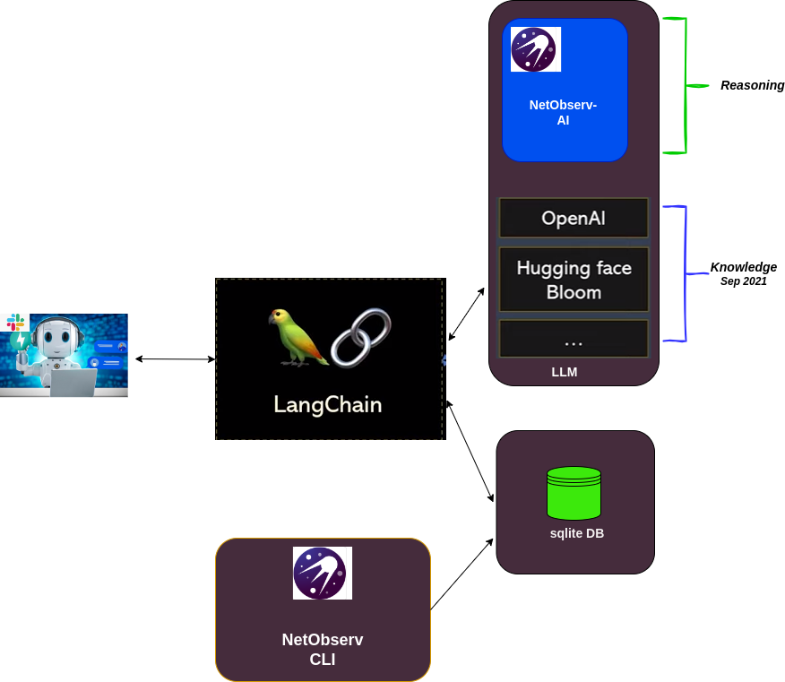

## Design Netobserv chatbot using [langchain](https://python.langchain.com/docs/get_started/introduction) frame work

<p align="center">

</p>

### install the following packages
```shell

pip install langchain
pip install openai
pip install -U langchain-community
pip install -U langchain-openai
pip install -U slack_bolt
pip install -U tabulate
pip install -U langchainhub
```


### create OpenAI API key
https://platform.openai.com/api-keys
then add it to `secret_key.py`

### How to generate flows data bases
- bring up an OpenShift cluster
- clone https://github.com/msherif1234/network-observability-cli/tree/cli-intg
- `make build`
- then run `./build/oc-netobserv-flows-db`
that will generate flows.db locally then copy to ai repo or create symlink

### How to run
```python
python3 chat_netobserv.py
```

### How to run after setting up slack
Note: need to add set slack environment variables in `slack_key.py`
https://api.slack.com/apps/A06PUPX71S9/general?

```python
python3 netobserv_slack.py
```

### How to run with cli
```python
python3 netobserv_cli.py --help
usage: netobserv_cli.py [-h] (--drop | --nodrop | --slowrtt | --slowdns)

NetObserv chatbot CLI

options:
  -h, --help  show this help message and exit
  --drop      show flows with drop
  --nodrop    show flows without drop
  --slowrtt   show flows with slow rtt
  --slowdns   show flows with slow dns queries
  --netpol    show flows with netpol drops
```

### standalone client/serve langchain testing
in `chat_netobserv.py`
invoke `netobserv_ai_server(agent_executor)` then run `python3 netobserv_client.py`
that will connect to server at `localhost:8000` and send queries to langchain agent